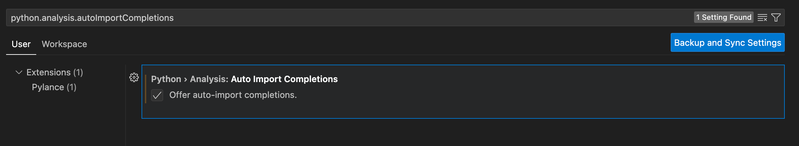

# Getting Started with Python in VS Code

This repository stores the codes from [Python tutorials in Visual Studio Code](https://code.visualstudio.com/docs/python/python-tutorial).


### Key Notes

#### Enable Auto Imports
Pylance offers auto import suggestions for modules in your workspace and/or packages you have installed in your environment. This enables import statements to be automatically added as you type. Auto imports are disabled by default, but you can enable them by setting python.analysis.autoImportCompletions to true in your settings.



#### Unit Testing 

Remember to install pytest module with the following command to allow running tests in parallel. (For mac users)
```
python3 -m pip install pytest-xdist
```